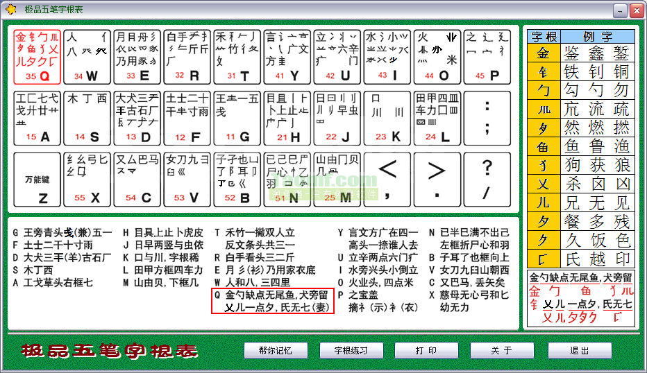
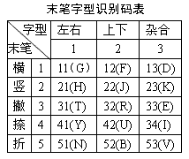
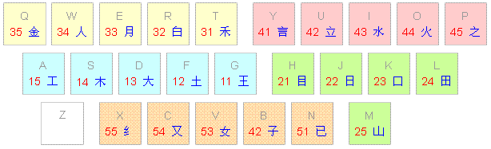

# wubi-course

> A basic course of wubi input method

## 常见版本

- 86 版
- 98 版
- 18030 版
- **最多使用为 86 版，86 版是后两者的基础，当前流行的五笔输入法都支持 86 版**

## 五笔字根分布规则

- 五笔字根一共有五类（横、竖、撇、捺、折）
- 五类分布在键盘五个区域，每个区域 5 个按键（所以一共 25 个按键 a~y，z 为学习键）
- 每个区域按键分布如下
  - 横区（1 区）
    - 按键：gfdsa
    - 首笔都为横
  - 竖区（2 区）
    - 按键：hjklm
    - 首笔都为竖
  - 撇区（3 区）
    - 按键：trewq
    - 首笔都为撇
  - 捺区（4 区）
    - 按键：yuiop
    - 首笔都为捺
  - 折区（5 区）
    - 按键：nbvcx
    - 首笔都为折
- 每个按键上会分布若干字根
- 通过将汉字拆分为字根，然后按对应字根键完成输入

### 五个笔画

五个笔画（一、丨、丿、丶、乙）分别放在 11、21、31、41 和 51 里面。

- 一横、两横、三横分别放在 11、12、13 里面；
- 一竖、两竖、三竖、四竖分别放在 21、22、23、24 里面；
- 一撇、两撇、三撇分别放在 31、32、33 里面；
- 一点、两点、三点、四点分别放在 41、42、43、44 里面；
- 一折、两折、三折分别放在 51、52、53 里面；

### 分区分析

- 首先分析字析“王”这个字根，它的第一划，第二划都是横，横为 1 区，所以它所在键位为 11（第一划第二划都是 1）
- 再分析字析“土”这个字根，它的第一划为横（横为 1 区），第二划为竖（竖为 2 区），所以它所在键位为 12
- 再分析字析“大”这个字根，它的第一划为横（横为 1 区），第二划为撇（撇为 3 区），所以它所在键位为 13
- 再分析字析“七”这个字根，它的第一划为横（横为 1 区），第二划为折（折为 5 区），所以它所在键位为 15

### **字根表-重要**



## 拆字规则（汉字按什么规则拆分为字根）-怎么拆

### 总体原则:规范笔顺、取大优先,兼顾直观,能连不交,能散不连

- 一、规范笔顺
  - 按照笔顺取编码
- 二、取大优先
  - 按照书写顺序为汉字编码时，拆出来的字根要尽可能大，即“再添一个笔画，便不能构成笔画更多的字根”为限度

```
世：廿 乙 （正确）
世：一 凵 乙 （错误）
亲：立 木 （正确）
亲：立 一 小 （错误）
```

- 三、兼顾直观
  - 在确认字根时，为了使字根的特征明显易辩，有时就要牺牲书写顺序和取大优先的原则。

```
国：如按书写顺序，其字根应是“冂、王、丶、一”，但这样编码不断有违该字的字源，也不能使字根“囗”直观易辩。为了直观，国字的正确拆分应该是：“囗、王、丶”
```

- 四、能连不交
  - 当一个字可以视作相连的几个字根，也可视作相交的几个字根时，我们认为，相连的情况是可取的

```
天：一 大 （二者是相连的） （正确）
天：二 人 （二者是相交的） （错误）
```

- 五、能散不连
  - 如果一个结构可以视为几个基本字根的散的关系，就不要认为是连的关系。例如

```
占： 卜 口 （都不是单笔画，应视作上下关系）
非： 三 刂 三 （都不是单笔画，应视作左右关系）
```

- 常规总结
  - 一般说来，应当保证每次拆出最大的基本字根，在拆出字根的数目相同时，“散”比“连”优先，“连”比“交”优先。散>连>交

### 补充

- 一 “能连不交”优于“取大优先”。
  - “能连不交”和“取大优先”如有矛盾，几乎都采取“能连不交”优于“取大优先”的原则处理

```
例如：
“天”字只能拆为“一”、“大”，而不能拆成“二”、“人”。
“矢”字只能拆为“”、“大”，而不能拆成“”、“人”。
“开”字只能拆为“一”、“廾”，而不能拆成“二”、“”。
个别的例外：“平”字刚好相反，只能拆成“一”、“”、“丨”，不能拆成“一”、“丷”、“十”。
```

- 二 “能散不连”优于“取大优先”

  - 能散不连在拆字中几乎是不言而喻的事实。它很自然地将一个汉字分成若干独立的字根或字根的组合。有少量字根本身由分散笔画组成，使得在拆字中产生多种取码方案的时候，往往是先考虑“能散不连”。例如“主”字，依“取大优先”应拆成“亠”和“土”，依“能散不连”则可分为“丶”和“王”。根据这条潜规则选择后者。

- 三 “规范笔顺”和“兼顾直观”的主次关系。

  - 你发现“面”字和“靣”字的拆字方法不一样吗？看完下面内容你就知道了。
    在多数情况下，“规范笔顺”优于“兼顾直观”，特别在字根之间笔画有“交”、“连”的情况下更为明显。例如“秉”字分为“丿”、“一”、“彐”、“小”，而不分为“禾”和“彐”。“夷”字分成“一”、“弓”、“人”，而不分为“大”和“弓”。“曲”字分成“冂”和“”而不分为“囗”和“卄”。
  - 当字根之间没有笔画“交”“连”时，往往情况和上面完全相反，即“兼顾直观”优于“规范笔顺”。如“乘”不分为“丿”、“一”、“”、“匕”、“小”，而分成“禾”、“”、“匕”。“爽”字不分为“一”、“乂”、“乂”、“乂”、“乂”、“人”，而分成“大”、“乂”、“乂”、“乂”、“乂”。所谓“往往”，是因为有个别例外，如“平”字就不分成“干”和“丷”了。

- 四 被分开的字根的排列顺序先于分开它的字根。
  - 在第三条的后半部，被分开“禾”和“大”都放在其他字根前面。再看看“国”字的“囗”放在“王”和“丶”的前面。“必”的“心”放在“丿”的前面。“酉”字的“西”置于“一”的前面。“肃”字的“小”字书写时被“”分开，也放在“”前面。究其原因，尽管被分开的字根最后一笔书写时落在最后，可能因为它的首笔书写时早于其他字根，所以应该居前。
    必须指出：有个别字的拆法既不符合拆字规则，也不符合这些潜规则，讲好听点叫“凭经验打字”，讲不好听点就是“只能死记硬背”了。
  - 例如“拜”字的右边，按拆字规则应该拆成“三”和“十”，但不知道为什么却拆成“二”、“二”和“丨”。还有字根“戈”的末笔 取“丿”是不符合规范的，初学者往往打不出来。好在这种情况的数量不多，就算小小的 bug 吧，不至于影响大局。

### 歌谣口诀

```
五笔字型均直观，依照笔顺把码编；
键名汉字打四下，基本字根请照搬；
一二三末取四码，顺序拆分大优先；
不足四码要注意，交叉识别补后边。
```

- 一、取码顺序，依照从左到右，从上到下，从外到内的书写顺序（见“依照笔顺把码编”句）
- 二、键名汉字（见“键名汉字打四下”句）
- 三、字根数不足四或大于四时，按一、二、三、末字根顺序取四码（见“一二三末取四码”句）
- 四、不足四个字根时，打完字根后，补交叉识别码（[末笔区位识别码](http://www.wubizigen.net/html/jiangyi_4.html)）于尾部。此种情况下，码长为３或４（见歌诀末行）。歌诀中“基本字根请照搬”句和“[顺序拆分大优先](http://www.wubizigen.net/html/chaifenguize.html)”是拆分原则。就是说在拆分中以基本字根为单位，并且在拆分时“取大优先”，尽可能先拆出笔画最多的字根。或者说在[五笔输入](http://www.wubizigen.net/wubidown/)时拆分出的字根数要尽量少

### [末笔区位识别码](http://www.wubizigen.net/html/jiangyi_4.html)

#### 汉字的字型可分为三类

- 第一类   左右型。例字：汉、始、倒。
- 第二类   上下型。例字：字、型、森、器。
- 第三类   杂合型。例字：国、这、函、问、句。有一些由两个或多个字根相交而成的字，也属于第三类。例如：“必”字是由字根“心”和“丿”组成的；“毛”字是由“丿”“二”和“乚”组成的!

#### 确定识别码，请记住以下八个字：“笔画分区，字型判位”

- 末笔通常是指一个字按笔顺书写最后一笔。在少数情况下指某一字根的最后一笔。
  - 我们已经知道五种笔画的代码 1 横、2 竖、3 撇、4 捺、5 折。用这个代码分区（表中的行）。
  - 再用刚刚讲过的三类字型判位，左右为 1，上下为 2，杂合为 3（右表的三列）这就构成所谓“末笔字型识别码”。

```
举几个例子：
“组”字末笔是横，区码为 1；字型是左右型，位码也是 1；“组”字的末笔区位识别码就是 11（G）。
“旱”字末笔是竖，区码为 2；字型是上下型，位码为 2；所以“旱”字的末笔区位识别码为 22（J）。
“笔”字末笔是折，区码应为 5；字型是上下型，位码为 2；所以“笔”字的末笔区位识别码为 52（B）
```

#### 字型识别码表



## 按什么规则将字根组合成文字或词组输入-怎么合

### 键名字

- 字根表里每个按键的首个助记词为键名字，其可以通过快速敲击四次快速输入；
  - 如言 ─YYYY，又 ─CCCC，山 ─MMMM

#### 键名字表



### 五种笔画快速输入

- 连续按两下所在区的第一键
- 再按一次 L 键即可
- 示例：
  - 横 ggl 一
  - 竖 hhl 丨
  - 撇 ttl 丿
  - 捺 yyl 丶
  - 折 nnl 乙

### 字根字（成字字根）

- 在字根总表中除了键名字以外，还有六十几个字根本身也是成字。如“五、雨、口、马…”。这些字称为“字根字”。它们的输入方法是：
  - 1、“报户口”，即按一下该字所在的键。
  - 2、再按笔画输入三键，即该字的第 1、2 和末笔所在的键。

```
如：西字，先击西字所在的键 S 报户口，再输入一、丨和末笔一（SGHG），方（YYGN），厂（DGT 加空格）

字根字有：一、五、戋、士、二、干、十、寸、雨、犬、三、古、石、厂、丁、西、七、弋、戈、廿、卜、上、止、曰、早、虫、川、甲、四、车、力、由、贝、几、竹、手、斤、乃、用、八、儿、夕、广、文、方、六、辛、门、小、米、己、巳、尸、心、羽、了、耳、也、刀、九、臼、巴、马、弓、匕
```

### **一级简码(高频字码)-重要**

- 这类字只要击键一次，再加击一次空格键，即可完成输入；
- 每个按键一个，一共 25 个，z 为学习键，当你忘了一两个字根的代码时，你可以用它代替，程序将列出有关的字给你选择。但有些五笔型输入法不使用这个功能。

```
一级简码所包含的 25 个汉字
一（Ｇ） 地（Ｆ） 在（Ｄ） 要（Ｓ） 工（Ａ）
上（Ｈ） 是（Ｊ） 中（Ｋ） 国（Ｌ） 同（Ｍ）
和（Ｔ） 的（Ｒ） 有（Ｅ） 人（Ｗ） 我（Ｑ）
主（Ｙ） 产（Ｕ） 不（Ｉ） 为（Ｏ） 这（Ｐ）
民（Ｎ） 了（Ｂ） 发（Ｖ） 以（Ｃ） 经（Ｘ）
```

### 二级简码

- 二级简码字的简码和其全码的前两位相同，即只用前两个字根编码
- 五笔字根表下的汉字正常情况下打一字需要敲打四次键位，但为了提高输入速度，挑出 600 个比较常的汉字做个二级简码表，虽然一级简码速度快，但毕竟只有 25 个，真正大大提高五笔输入速度的是二级简码的这 600 个常类汉字

```
Ｇ五于天末开 下理事画现 玫珠表珍列 玉平不来 与屯妻到互
Ｆ二寺城霜载 直是吉协南 才垢圾夫无 坟增示赫过 志地雪支
Ｄ三夺大厅左 丰百右历成 帮原胡春克 太磁砂灰达 成顾肆友龙
Ｓ本村枯林械 相查可楞机 格析极检构 术样档杰棕 杨李要权楷
Ａ七革基苛式 牙划或功贡 攻匠菜共区 芳燕东 芝 世节切芭药
Ｈ睛睦 盯虎 止旧占卤贞 睡 肯具餐 眩瞳步眯瞎 卢 眼皮此
Ｊ量时晨果虹 早昌蝇曙遇 昨蝗明蛤晚 景暗晃显晕 电最归紧昆
Ｋ呈叶顺呆呀 中虽吕另员 呼听吸只史 嘛啼吵 喧 叫啊哪吧哟
Ｌ车轩因困 四辊加男轴 力斩胃办罗 罚较 边 思 轨轻累
Ｍ同财央朵曲 由则 崭册 几贩骨内风 凡赠峭 迪 岂邮 凤
Ｔ生行知条长 处得各力向 笔物秀答称 入科秒 管 秘季委么第
Ｒ后持拓打找 年提扣押抽 手折扔失换 扩拉朱搂近 所报扫反批
Ｅ且肝 肛 胆肿肋肌 用遥朋脸胸 及胶膛 爱 甩服妥肥脂
Ｗ全会估休代 个介保佃仙 作伯仍从你 信们偿伙 亿他分公化
Ｑ钱针然钉氏 外旬名锣负 儿铁角欠多 久匀乐炙锭 包凶争色
Ｙ主计庆订度 让刘训为高 放诉衣认义 方说就变这 记离良充率
Ｕ闰半关亲并 站间部曾商 产瓣前闪交 六立冰普帝 决闻妆冯北
Ｉ汪法尖洒江 小浊澡渐没 少泊肖兴光 注洋水淡学 沁池当汉涨
Ｏ业灶类灯煤 粘烛炽烟灿 烽煌粗伙炮 米料炒炎迷 断籽娄烃
Ｐ定守害宁宽 寂审宫军宙 客宾家空宛 社实宵灾之 官字安 它
Ｎ怀导居 民 收慢避惭届 必怕 愉懈 心习悄屡忱 忆敢恨怪尼
Ｂ卫际承阿陈 耻阳职阵出 降孤阴队隐 防联孙耿辽 也子限取陛
Ｖ姨寻姑杂毁 旭如舅 九 奶 婚 妨嫌录灵巡 刀好妇妈姆
Ｃ 对参 戏 台劝观 矣牟能难允 驻 驼 马邓艰双
Ｘ线结顷 红 引旨强细纲 张绵级给约 纺弱纱继综 纪弛绿经比
```

### 三级简码

- 输入三级简码字也只需击四键（含一个空格键），三个简码字母与全码的前三者相同。但用空格代替了末字根或代替识别码。

### **词组输入-重要**

- 二字词的词语由所含的两个汉字各取两个字根码组成，即每字按笔顺取前个字根为编码
  - 分别取单字的前两个码。如：机器（SMKK），经济（XCIY），汉字（ICPB）。
- 三字词前两汉字各取第一码，最后一字取前两码
  - 前两字各取第一码，后一字取前两码。如：电话机（JYSM），操作员（RWKM），计算机（YTSM）
- 四字词的词语由每个汉字的第一码组成词语的输入码
  - 取每个单字的第一码。如：中文信息（KYWT），知识分子（TYWB）
- 超过四个字的词，前三个字各取第一个字根码，词语码的第四码是由最末一个汉字的首码组成。换句话说：是由一二三和末四个字的第一字根构成的
  - 分别取第一、二、三及末字的第一码。如中华人民共和国（KWWL），中国人民解放军（KLWP）。
